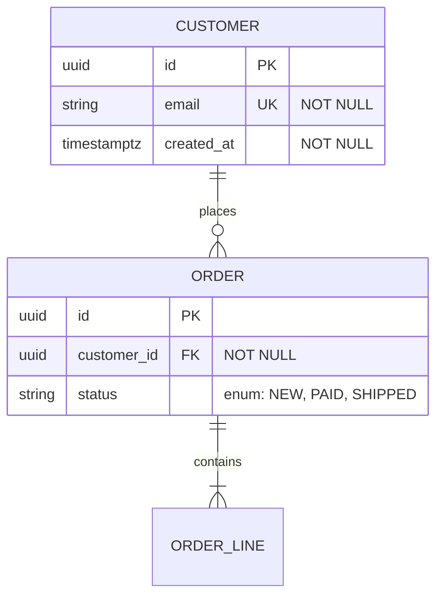

# Spring Boot Suite

A complete, opinionated toolkit for building and shipping production Spring Boot backends —
from first data model through running CI/CD pipeline.

---

## What's inside

| Sub-skill | Purpose | When to use it |
|---|---|---|
| **springboot-backend** | Production conventions, layering, JPA, Flyway, Security, Testing, OpenAPI | Any coding task on a Spring Boot codebase |
| **spring-boot-spec-driven** | Docs-first delivery — data model → dataflow → architecture → code | Implementing tickets, features, new entities, or bootstrapping a new service |
| **monorepo-cicd** | GitHub Actions → Argo CD → EKS pipeline, Terraform, K8s manifests | Deploying or setting up CI/CD |
| **Claude Code hooks** | File protection + Spotless auto-format on every edit | Included automatically via `.claude/settings.json` |

---

## Which sub-skill to activate

```
Task type                          → Use
─────────────────────────────────────────────────────────────────────
Implement a ticket / add a feature → spring-boot-spec-driven (docs first)
                                     then springboot-backend (code)
Start a brand-new service          → spring-boot-spec-driven (Workflow B)
                                     then springboot-backend (scaffold)
Code review / refactor             → springboot-backend (java-best-practices.md)
Set up CI/CD or deploy to K8s      → monorepo-cicd
Pure coding Q&A / best practices   → springboot-backend
```

When in doubt, start with **spring-boot-spec-driven** — it will tell you when to
hand off to **springboot-backend** for implementation.

---

## Sub-skill 1 — springboot-backend

**Full instructions:** see `references/spring-boot-core.md` and the other reference
files. The table below maps tasks to files.

### CRITICAL — confirm requirements before generating

Do not assume versions. Ask in one short batch if not already stated:
- Java version (17, 21, 25)
- Spring Boot version (3.x, 4.x)
- Build tool (Maven or Gradle)
- Database (PostgreSQL, MySQL, H2)
- Whether service layer, security, and migrations are needed

### Reference map

| Task | Read |
|---|---|
| Project structure, layering, DI, REST, config, profiles | `references/spring-boot-core.md` |
| Entities, repositories, relationships, N+1, transactions | `references/persistence-jpa.md` |
| Schema changes, versioned `V__` scripts, zero-downtime DDL | `references/flyway-migrations.md` |
| Auth, filter chain, 401/403, CSRF, method security | `references/spring-security.md` |
| OpenAPI/Swagger UI, springdoc, `@Tag`/`@Operation` | `references/api-documentation.md` |
| Unit, `@WebMvcTest` slice, Testcontainers integration tests | `references/spring-boot-testing.md` |
| Clean code, SOLID, immutability, exceptions, concurrency | `references/java-best-practices.md` |

Read the matching reference file **before** doing the work. Load only the ones you need.

### Greenfield workflow order

1. `spring-boot-core` — project structure and domain model
2. `persistence-jpa` — entities and repositories
3. `flyway-migrations` — schema
4. `spring-boot-core` — service and controller layers
5. `api-documentation` — OpenAPI/Swagger (add to every REST API by default)
6. `spring-security` — authentication and authorization
7. `spring-boot-testing` — unit, slice, and integration tests
8. `java-best-practices` — review and refactor passes

### Validate before declaring done

```bash
./mvnw test          # unit + slice tests
./mvnw verify        # Testcontainers integration tests
# or Gradle equivalents
./gradlew test
./gradlew check
```

---

## Sub-skill 2 — spring-boot-spec-driven

**Docs before code. Data model before everything.**

Full instructions are in `references/spec-driven.md`. Summary:

### Three living documents (source of truth)

```
docs/context/
├── datamodel.md      # entities + Mermaid E-R diagram
├── dataflow.md       # flows, sequence diagrams, integrations
└── architecture.md   # components, layering, packages, decisions
```

### Start-state detection

| `docs/context/` exists? | Code exists? | Mode |
|---|---|---|
| Yes | Yes | **A — Existing project** (read docs, then implement) |
| No | Yes | **Bootstrap** (reverse-engineer docs from code, then Mode A) |
| No | No | **B — Greenfield** (author docs from spec → approval gate → scaffold) |

### Workflow A (per ticket) — non-negotiable order

1. Load all three context docs
2. **Data model FIRST** — update `datamodel.md` + Mermaid `erDiagram` before anything else
3. Update `dataflow.md` — flows and sequence diagrams
4. Update `architecture.md` — only if structure changes
5. Implement via TDD (compose with springboot-backend references)
6. Commit docs + code in the **same PR**

### Workflow B (greenfield)

1. Anchor on the epic / spec
2. Create `docs/context/` skeleton from templates in `assets/templates/`
3. Author `datamodel.md` + E-R diagram from requirements
4. Author `dataflow.md` and `architecture.md`
5. **HUMAN APPROVAL GATE — stop here and get explicit sign-off**
6. Scaffold Spring Boot project to match `architecture.md`
7. Implement feature by feature via TDD (then use Workflow A per ticket)

### E-R diagram conventions



Entity names = JPA `@Entity` class names (PascalCase). JPA associations must match
cardinality in the diagram exactly.

---

## Sub-skill 3 — monorepo-cicd

Full instructions are in `references/monorepo-cicd-infra.md`,
`references/monorepo-cicd-frontend.md`, and `references/monorepo-cicd-backend.md`.

### Step 1 — Collect inputs

Ask the user their role (frontend / backend / full-stack), then collect:

**All users:**
- Project / repo name, GitHub org/user, AWS region, AWS account ID, deploy branch

**Backend devs also:**
- Language/framework, runtime version, start command, port, runtime env var names

**Frontend devs also:**
- Framework, Node version, build command, port, API URL env var name

### Step 2 — Confirm inputs before generating any files

Echo all collected values and get explicit confirmation.

### Step 3 — Generate files

Read the matching reference file(s), then generate all files with real values (no placeholders):

| File | Reference |
|---|---|
| `infra/terraform/` (main, variables, outputs, eks, ecr, vpc, iam, backend) | `references/monorepo-cicd-infra.md` |
| `argocd/` app YAMLs | `references/monorepo-cicd-infra.md` |
| `apps/backend/Dockerfile`, `.dockerignore`, K8s manifests, GitHub Actions workflow | `references/monorepo-cicd-backend.md` |
| `apps/frontend/Dockerfile`, `.dockerignore`, K8s manifests, GitHub Actions workflow | `references/monorepo-cicd-frontend.md` |
| `.gitignore`, `README.md` | inline |

Write all files to `/mnt/user-data/outputs/`, then zip and present.

### Step 4 — Post-generation next steps (tell the user)

1. `terraform init && terraform apply` from `infra/terraform/`
2. Add GitHub Secrets: `AWS_ACCESS_KEY_ID`, `AWS_SECRET_ACCESS_KEY`, `AWS_ACCOUNT_ID`
3. Install Argo CD: `kubectl apply -n argocd -f https://raw.githubusercontent.com/argoproj/argo-cd/stable/manifests/install.yaml`
4. Apply Argo CD apps: `kubectl apply -f argocd/`
5. Push to deploy branch — pipeline runs automatically

---

## Claude Code hooks

These ship with the skill and are applied to `.claude/settings.json` in your project.

### File protection (PreToolUse)

Blocks edits to `.env`, `package-lock.json`, and `.git/` before any Edit/Write/MultiEdit.
Script: `hooks/protect-files.sh`

```bash
#!/usr/bin/env bash
# protect-files.sh
INPUT=$(cat)
FILE_PATH=$(echo "$INPUT" | jq -r '.tool_input.file_path // empty')

PROTECTED_PATTERNS=(".env" "package-lock.json" ".git/")

for pattern in "${PROTECTED_PATTERNS[@]}"; do
  if [[ "$FILE_PATH" == *"$pattern"* ]]; then
    echo "Blocked: $FILE_PATH matches protected pattern '$pattern'" >&2
    exit 2
  fi
done

exit 0
```

### Auto-format (PostToolUse)

Runs `./gradlew spotlessApply` silently after every Edit/Write/MultiEdit so Java
is always formatted without manual intervention.

### settings.json snippet

```json
{
  "hooks": {
    "PreToolUse": [
      {
        "matcher": "Edit|Write|MultiEdit",
        "hooks": [
          {
            "type": "command",
            "command": "\"$CLAUDE_PROJECT_DIR\"/.claude/hooks/protect-files.sh"
          }
        ]
      }
    ],
    "PostToolUse": [
      {
        "matcher": "Edit|Write|MultiEdit",
        "hooks": [
          {
            "type": "command",
            "command": "\"$CLAUDE_PROJECT_DIR\"/gradlew spotlessApply --quiet -p \"$CLAUDE_PROJECT_DIR\" 2>&1 | tail -5"
          }
        ]
      }
    ]
  }
}
```

---

## Guardrails (all sub-skills)

- **Docs before code, data model before everything** (spec-driven)
- **No silent drift** — docs and code change together in the same PR
- **No placeholders** — generated files always use real collected values (CI/CD)
- **Confirm requirements before generating** — never assume Java/Boot/DB versions
- **Test before done** — build must be green (`mvnw test` / `gradlew test`)
- **OpenAPI on every REST API** — add springdoc by default, never opt-out silently
