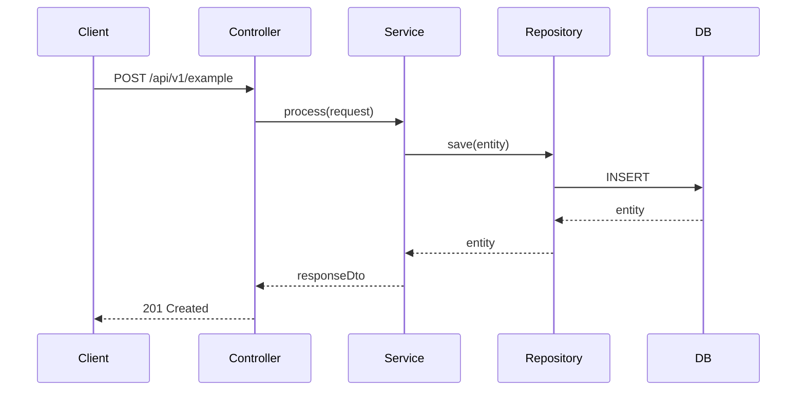

# Dataflow

> How data moves through the system: triggers, steps, integrations, sequence diagrams.
> Update this doc *before* writing service or controller code for a new flow.

## Flows

<!-- One section per primary use case / API endpoint group -->

### Flow Name

**Trigger:** `POST /api/v1/example`
**Auth:** Bearer JWT (ROLE_USER)

Steps:
1. Controller validates request DTO
2. Service calls repository
3. ...
4. Returns response DTO

## External Integrations

| System | Protocol | Direction | Purpose |
|---|---|---|---|
| | REST / Kafka / etc | inbound / outbound | |
